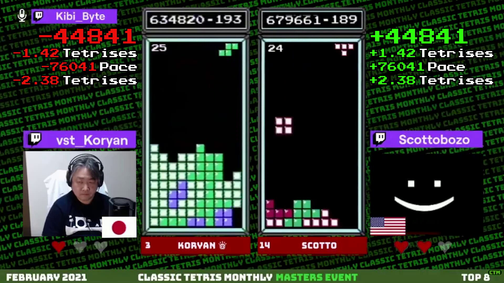

This Repo contains a script to help [aGameScout](https://www.twitch.tv/agamescout) prepare the CTM video with extra stats for his commentary

# Installation

(OSX instruction)

This was only tested in python 3.7.9, so on OSX use it with `brew`:

```bash
brew update
brew install python@3.7
brew link --overwrite python@3.7
pip3 install -r requirements.txt
```

# Usage

Preferrably have the video segments you want to annotate with stats ready. Do not mix multiple games by multiple players in the same video file, because it is likely the location of their game stats changes a bit.

Instead, cut your video into segment by game to comment on, and then identify the location of the data areas for player 1 and 2 in `(x, y, width, height)` tuples, and populate them the script.

```python
p1_lines_xywh = (818, 58, 101, 31)
p1_score_xywh = (572, 59, 206, 32)
p1_level_xywh = (577, 168, 57, 28)

p2_lines_xywh = (1260, 58, 100, 32)
p2_score_xywh = (1016, 61, 205, 32)
p2_level_xywh = (1022, 171, 56, 27)
```

This can be easily found in any graphic editor like gimp, like below:


Then run the script with
```
python3 generate.py FILEPATH_TO_VIDEO_FILE
```

# Sample output



Data presented:
* Score difference betweeen the 2 players, based on current scores
* Score difference in term of tetrises (taking level progression into account)
* Pace score difference
* Pace score difference in term of tetrises

The pace score is computed by projecting the player into the future, starting from their current state of score, lines, and level, and assuming they will score only tetrises all the way into the kill screen. This basically computes the best score they could possibly get in this ongoing game. The projection stops as soon as level reaches level 29. As the projection progresses, the tetris values at the increasing levels are accumulated, until the final pace score emerges.

Some players can play several levels beyond the skill screen, but in the majority of cases, keeping kill screen as the baseline to compute a normalized pace score makes sense.

The pace score is an interesting metric because a player may be ahead in point at a given point in time, but also vastly ahead in lines. That mans his opponent could be doing better overall, but playing a little more slowly. The pace score metrics, by projecting a perfect play onto both players is an indicator of the overall performance in the game so far.


## Aknowledgment

OCR-ing the score, lines, level count from the CTM footage is done using the file `digitocr.py` from the excellent [NESTrisOCR](https://github.com/alex-ong/NESTrisOCR) project by [Alex Ong](https://github.com/alex-ong).


## Related Project

This project is pretty much a modified clone of [tetris_rate_adder](https://github.com/timotheeg/tetris_rate_adder), that I made for a similar purpose for [Chris Higgins](https://www.twitch.tv/higginspdx)'s project [Best of Five](https://www.kickstarter.com/projects/chrishiggins/best-of-five-the-classic-tetris-champions).

Take a look at [NESTrisStatsUI](https://github.com/timotheeg/NESTrisStatsUI) for a project computing Tetris stats from a live tetris games.